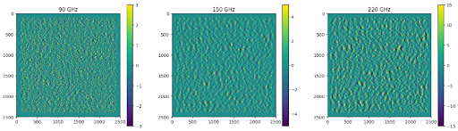
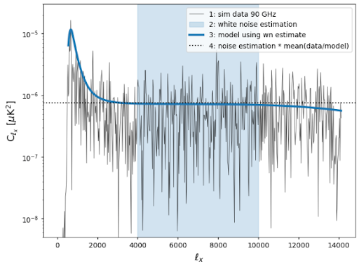
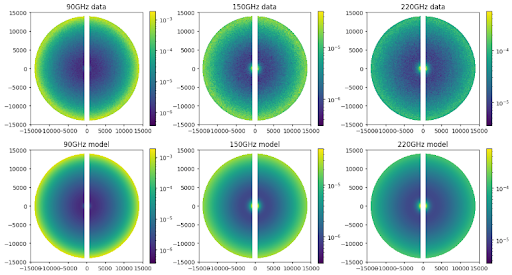
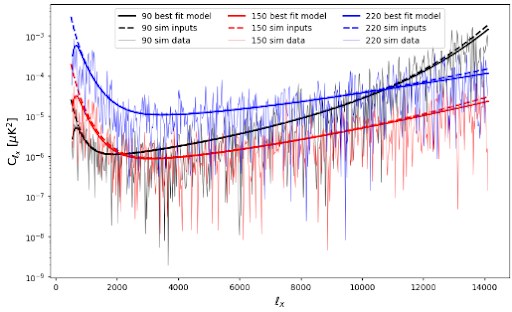
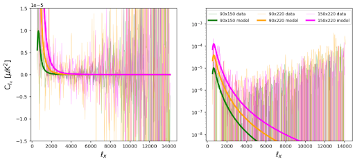
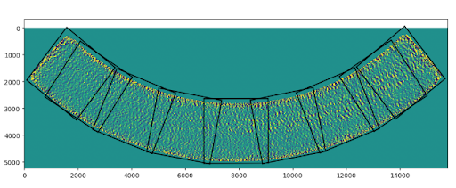
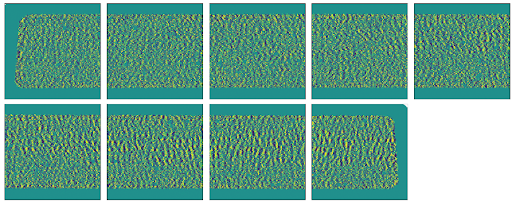
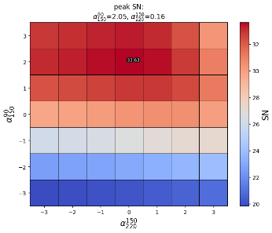
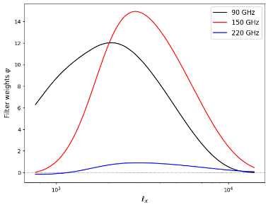
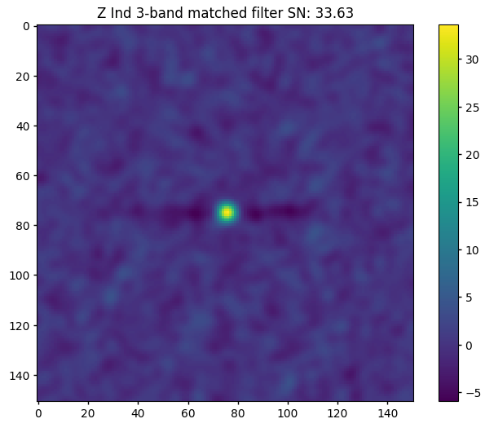

# SPT transient matched filter
A matched filter for the South Pole Telescope, designed to search for transient sources in single observation maps and remove atmospheric noise contributions through noise cross-correlations in the different observing bands. A portion of this code will not work as it requires access to private software and data, this is just a semi-working example of code I have written for this project. This glosses over a lot of details in favor of getting to the pretty looking pictures quickly.

maptools.py contains various helper functions, while matched_filter.py contains the matched filter itself.

Starting this project, we begin by simulating a small (5 degree x 5 degree) cutout of the sky in the three SPT observing bands (90, 150, 220 GHz) and inject a point source in a random location:

After various reprojections, beam and transfer function deconvolutions, and resizing of the maps we can now model the noise Power Spectral Densities of the maps, starting with an estimation of the white noise contribution.

Once we have estimated the white noise, found to be within ~1% of the input value to the simulation, we model all 3 beam-deconvolved maps to get the auto-spectra of their noise, with compariosns to the actual data as well as the input noise. I'm showing both a 2D noise PSD as well as a cutout in the positive $\ell_x$ regime of Fourier space.

The most difficult part of this project is modeling the cross-correlation of noise between the different observing bands. This is crucial to telling us the atmospheric contribution to the total noise (which we want to remove!)

Now that we have shown this as a proof-of-concept using simulations, we can try to recover a known transient source (the flaring star Z Ind) in real SPT data. First we take our input map and choose small, overlapping cutouts and reproject them from Zenith Equal Area to the Sanson-Flamsteed projection.

We follow the same process in our simulations to model the noise of each cutout separately, as we assume atmospheric properties may be different across the sky. When we have done that, we process the maps in a matched filter (see section 4 in https://arxiv.org/pdf/2506.00298 for a detailed example of a matched filter in SPT data) using the auto- and cross-spectra as components of the 3x3 noise covariance matrix.

We run the matched filter over a grid of spectral indices (slopes between flux values of a source at different observing frequencies) to maximize the signal-to-noise ratio, coming up with the ideal filter weights for any transient sources detected

And finally we show the recovered transient source: an actual detection of a flare coming from the star Z Ind with the atmospheric noise having been removed from the map.

